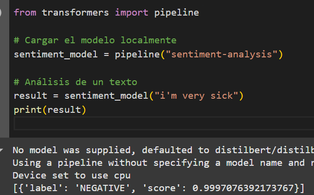

# Modelo Local

## Requisitos basicos

### Python
Necesitas Python 3.7 o superior.
Verifica tu versión con:
```python
python --version
```

### transformers
Instala la biblioteca transformers, que es necesaria para trabajar con modelos preentrenados de Hugging Face.
Comando:
```cmd
pip install transformers
```

### PyTorch o TensorFlow (uno de ellos):
Los modelos de Hugging Face pueden usar PyTorch o TensorFlow como backend. Si no especificas cuál usar, se instala automáticamente el compatible.
Para instalar PyTorch:

```cmd
pip install torch
```

### Tokenizers (opcional, pero recomendado):
La biblioteca transformers usa la biblioteca tokenizers para dividir el texto en subpalabras. Esto debería instalarse automáticamente con transformers.

se recomienda sacar el token en hughingface, si es para probar en googlecolab, simplemente es colocar el token junto con el nombre en la seccion izquierda en la parte de secrets

## Requisitos opcionales:

### Aceleración por hardware (GPU):

Si deseas acelerar la inferencia usando una GPU, instala la versión compatible de PyTorch o TensorFlow con CUDA.

### Actualización de pip:

Asegúrate de que pip esté actualizado para evitar problemas de instalación:

```cmd
pip install --upgrade pip
```

## Verificar
Después de instalar, ejecuta este código para confirmar que todo está funcionando correctamente, aunque todo esta en local.ipynb también:

```python
from transformers import pipeline

sentiment_model = pipeline("sentiment-analysis")
result = sentiment_model("I feel great!")
print(result)
```

## Resultados
se recomienda dar los datos en ingles para que el modelo pueda interpretarlo y generar una respuesta:




como se puede ver en las imagenes los datos generan un resultado o positivo o negativo dependiendo de lo que se escriba

# Uso de aplicativo con api's

## instalaciones
las instalaciones son muy basicas se recomienda seguir los pasos dados en:

[instalaciones](docs/codigos_terminal)

con esos pasos el aplicativo funcionaria correctamente

## Resultados
los resultados son generalmente muy buenos se genera texto e imagenes en un corto periodo de tiempo y el analisis se hace al instante de generar la imagen


ese seria el resultado para chat normal

ahora con la generacion de imagenes seria:


para despues analizar esa misma imagen


# Lo aprendido

en pocas palabras aprendí que transformers se usa generalmente para generar datos de modelos de ia muchisimo mas rapido que una api, pero mas sin embargo conlleva bastante hardware para poder hacerlos funcionar, y tambien aprendí que difusers se usa generalmente para multimedia, y transformers para generacion de texto


| **Aspecto**         | **Transformers**                              | **Diffusers**                                |
|----------------------|-----------------------------------------------|----------------------------------------------|
| **Enfoque principal**| Procesamiento de lenguaje natural (NLP).      | Generación de contenido visual (imágenes).   |
| **Modelos principales** | GPT, BERT, T5, RoBERTa.                      | Stable Diffusion, Imagen, DALL-E.            |
| **Tareas**           | Generación de texto, análisis de datos textuales. | Creación de imágenes y arte digital.        |
| **Tipo de modelos**  | Modelos Transformer (arquitectura).           | Modelos de difusión.                         |


las api son mas sencillitas de usar pero creo que conllevan algunos limites en la generacion de estas